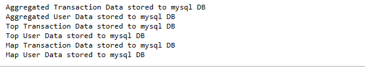
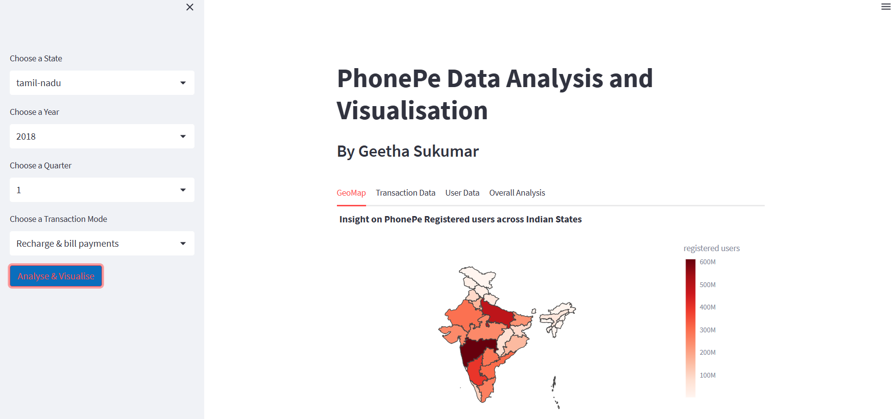
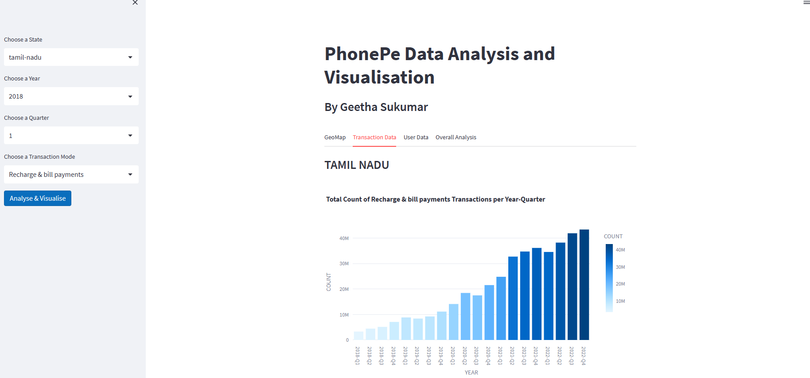
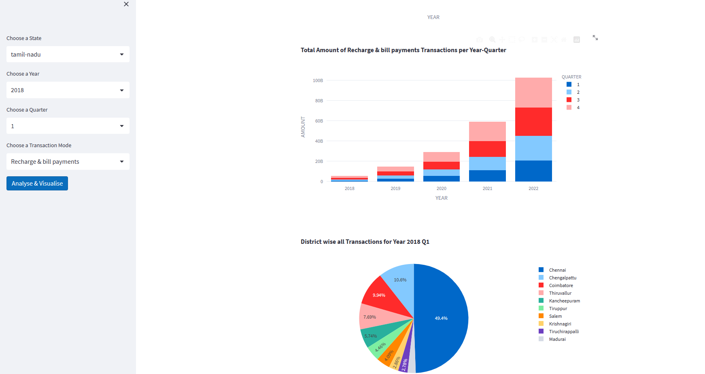
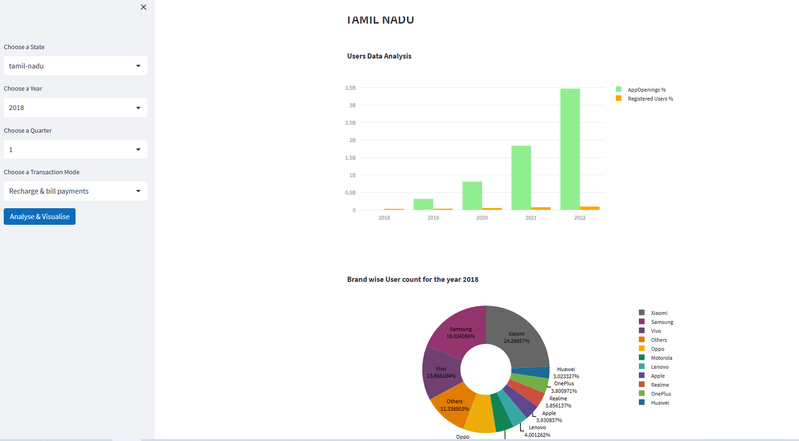
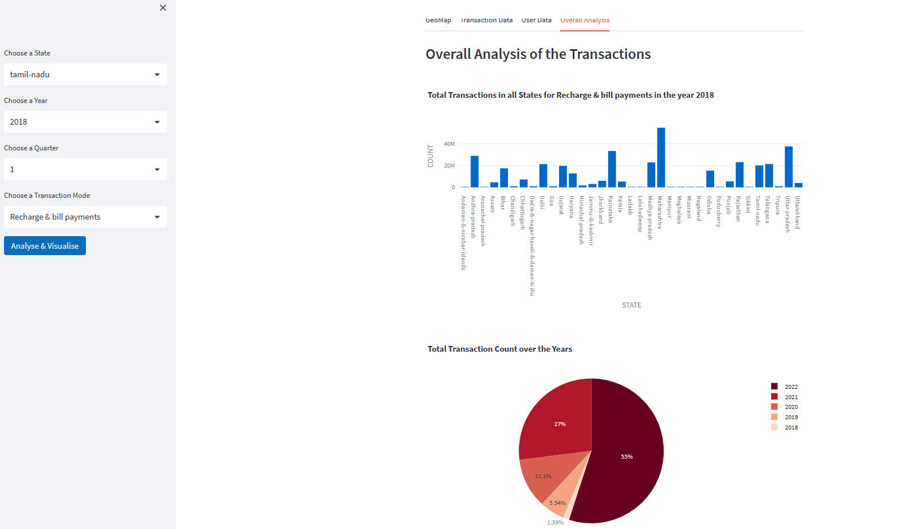

# PhonePe Pulse Data Visualisation
Phone pe Pulse Data Visualisation using Python - Pandas, Plotly, Streamlit, Mysql

## Objective
Phone pe Pulse Data Analysis and Visualisation using Python - Pandas, Plotly, Streamlit, Mysql.
This project aims to clone a PhonePe data from the Git and perform the Phonepe Pulse Data extraction, preparation, cleaning and storing the structured data in MySQL.
A User-friendly Streamlit application that helps to visualise the data stored in the mysql DB in different parameters as Charts 
A GeoMap Visualisation of PhonePe registered users in the different States of India.

## Prerequisties
1. MySQL DB.
2. Install the below python packages
  mysql.connector
  streamlit
  
## Setup
1. Pull the Data prepartion/cleaning python script phone_dataCollection.py
2. Create the MySQL DB and 6 tables created for Aggregated, top, user, map data on transaction and user. 
3. Clone the Phonepe Git repo using the command
   git clone https://github.com/PhonePe/pulse.git
4. Pull the script phone_dataCollection.py. This script will read the json files data for each quarter will be stored in the MySQL DB tables.
5. Pull the script phonepe_dashboard.py to visualise the data in different charts
   

## Run the Application
1. Go to Command Prompt
2. Change the working directory to the Directory where the code is pulled to
3. Start the mySQL DB
4. Run the command. Data will get stored in the mysql DB. Message will be printed on successful saving of data in MySQL in each of the tables
   python phone_dataCollection.py
4. Run the below code to run the Application in the browser
    streamlit run youtube_Data_collection.py

## Results

## Contact
Geetha Sukumar
geethsruthi@gmail.com

